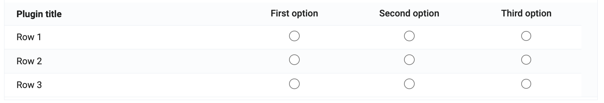
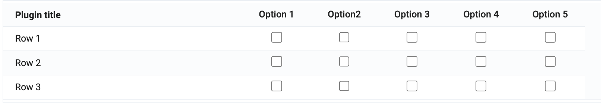
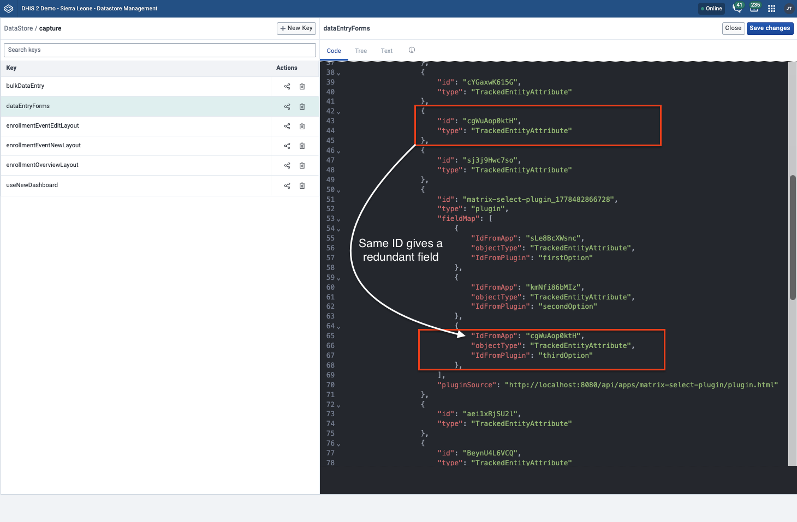

# Matrix Select

This is a custom form field plugin for the Capture app that renders multiple fields sharing the same option set as a matrix table. The plugin supports single select (radio buttons) and multi select (checkboxes).

| Part        | Meaning                                                    |
| ----------- | ---------------------------------------------------------- |
| **Rows**    | Form fields                                                |
| **Columns** | Options from the shared option set                         |
| **Cells**   | Radio buttons (single select) or checkboxes (multi select) |

### Examples

**Single select (radio buttons)**

**Multi select (checkboxes)**

## How it works

The plugin receives `fieldsMetadata` and `values` from the host form.

1. Filters fields that include an option set
2. Validates that all the fields's optionsets are the same
3. Optionally sets a title on the form if supplied as part of fieldsMetaData
4. Uses the first field’s option set to build table columns
5. Renders each row as a field and each cell as an input
6. Updates the values when a selection changes

## Installation

To install the plugin, follow these steps:

1. Go to the App Hub within the App Management app
2. Search for "Matrix Select"
3. Install the plugin

## Configuration

Use the Tracker Plugin Configurator app to configure the plugin.

1. Install the Tracker Plugin Configurator app from the App Hub and open it.
2. Select the page for form field.
3. Select the configuration context.
4. Click "Add configuration"
5. Click "Add element" and select the "Matrix Select" from the list of plugins.
6. Drag and drop the plugin to where you want it to be displayed in the form.
7. Click on the "Edit settings" icon to configure the fields that will be used in the matrix.
8. Save.

### Requirements

Fields passed to the plugin must:

- Have an option set
- Share the same options (same option set)

If these requirements are not met, the plugin will not be able to render the matrix and will display an error message.

### Optional title

You can supply a field whose value is used as the plugin title:

1. If not already present, you can add a data element or tracked entity attribute on the form with the title text you wish to use.
2. In the Tracker Plugin Configurator, include that field in the plugin inputs.
3. Set its alias to `title`. See photo below.

### Removing redundant fields

If you have existing fields that are no longer needed because they are now replaced by the plugin, you can remove them by following these steps:

1. Open the Datastore Management app
2. Select "capture" from the list of datastores
3. Select "dataEntryForms" from the list
4. Delete the fields you want to remove by deleting them from the code on the right hand side.
5. Click "Save changes".

