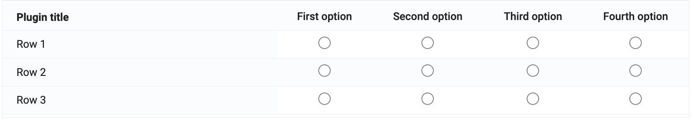
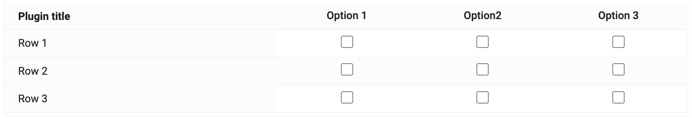
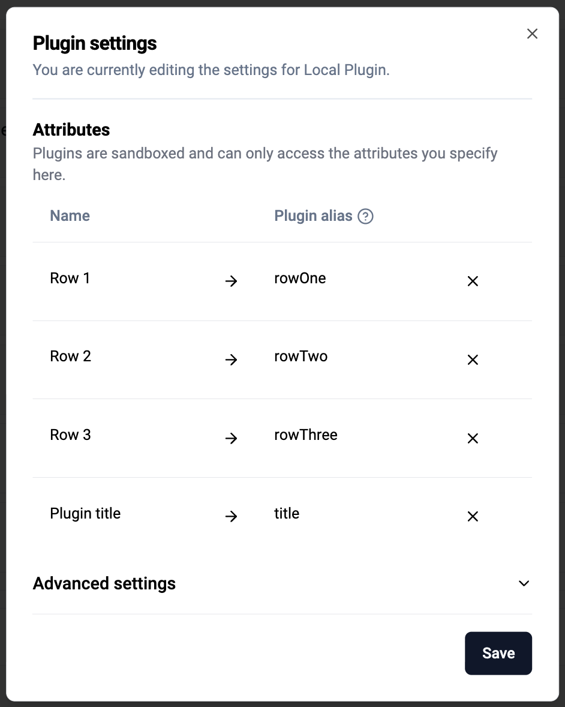

# Matrix Select Plugin

This is a custom form field plugin for Capture that renders multiple fields sharing the same option set as a matrix table.

| Part        | Meaning                                                    |
| ----------- | ---------------------------------------------------------- |
| **Rows**    | Form fields                                                |
| **Columns** | Options from the shared option set                         |
| **Cells**   | Radio buttons (single select) or checkboxes (multi select) |

### Examples

**Single select (radio buttons)**


**Multi select (checkboxes)**


## How it works

The plugin receives `fieldsMetadata` and `values` from the host form.

1. Filters fields that include an `optionSet`
2. Validates that all the fields's optionsets are the same
3. Optionally sets a title on the form if supplied as part of fieldsMetaData
4. Uses the first field’s option set to build table columns
5. Renders each row as a field and each cell as an input
6. Updates the values when a selection changes

## Configuration

Use the Tracker Plugin Configurator to configure the plugin.

Fields passed to the plugin must:

- Have an `optionSet`
- Share the same options (same option set)

### Optional title

You can supply a field whose value is used as the matrix title:

1. Add a data element on the form with the title text
2. In the Tracker Plugin Configurator, include that field in the plugin inputs
3. Set its alias to `title`



## Development

### Install dependencies

```bash
yarn install
```

### Run locally

```bash
yarn start
```

Runs the app in development mode. The plugin is available at:

- http://localhost:3000/

- http://localhost:3000/plugin.html

**Note:** The plugin has no fields to display in isolation. To see it in action, configure it via the Tracker Plugin Configurator and open it in the context of a Capture form.
